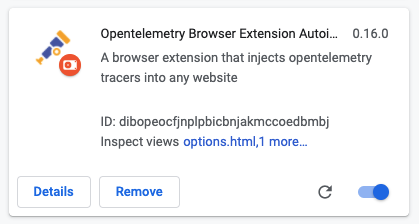
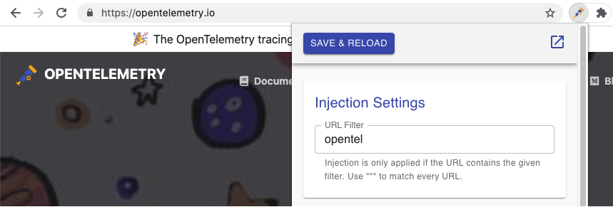
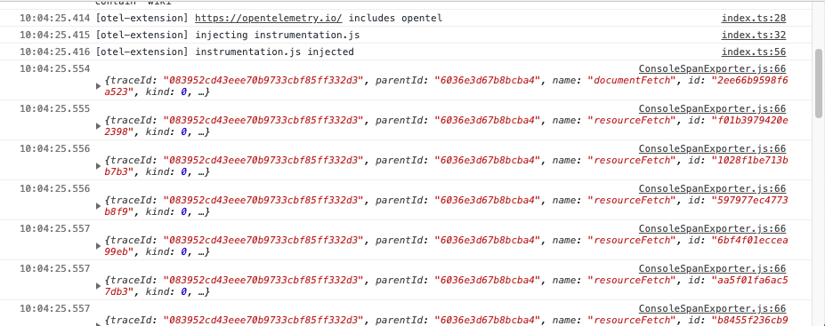

# OpenTelemetry Browser Extension

## :warning: ARCHIVED PROJECT

> This project has been archived by the maintainers on August 3 2022 because it was causing a failure in the CI and does not have any maintainer.
> Anyone who would like to maintain this project should open a PR to move it back into the lerna project and add themselves to the component owners file.

This browser extension allows you to inject [OpenTelemetry](https://opentelemetry.io/) instrumentation in any web page. It uses the [Web SDK](https://github.com/open-telemetry/opentelemetry-js/tree/main/packages/opentelemetry-sdk-trace-web) and can export data to Zipkin or an OpenTelemetry Collector.

Compatible with OpenTelemetry JS API and SDK `1.0+`.


## Supported Environments

* Google Chrome (with [Manifest Version 3](https://developer.chrome.com/docs/extensions/mv3/intro/) support)
* Chromium (with Manifest Version 2)
* Firefox (*unstable*, with Manifest Version 2)

## Installation

### from Source

Run the following in your shell to download and build the extension from source:

```shell
git clone https://github.com/open-telemetry/opentelemetry-js-contrib.git
cd opentelemetry-js-contrib/packages/opentelemetry-browser-extension-autoinjection
npm install
npm run build
```

This will create a so-called unpacked extension into the `build/` folder you now can load into your browser:

* Open a new browser window and go to chrome://extensions
* Turn on "Developer Mode"
* Click on "Load unpacked" and select the `build/mv3` (or `build/mv2`) folder, which contains the extension

If all goes well you should see the extension listed:



## Usage

When visiting a website, click on the extension icon, add an url filter that partially matches the current domain, e.g for [https://opentelemetry.io/](https://opentelemetry.io/) you can set "opentel" as value:



Click on `Save & Reload`, check the developer toolbar to see how spans being are printed to the console and being sent to your collector:



## Known Limitations

1. The extension works with [active tab](https://developer.chrome.com/docs/extensions/mv3/manifest/activeTab/) permission, this means that every time you want to use it, you have to click the extension icon at least once for your tab.

2. The use of the zone context manager and the used instrumentation libraries are fixed.

3. Firefox support is unstable, sometimes it works, sometimes not. If you have experience building extensions for firefox, please reach out.

4. The website you are targeting with this extension might have a [Content Security Policy](https://developer.mozilla.org/en-US/docs/Web/HTTP/Headers/Content-Security-Policy) (CSP) in place and block the extension from injecting javascript or block the exporters from sending spans to a collector. To work around this limitation, you need another browser extension, that allows you to disable CSP for a website.
