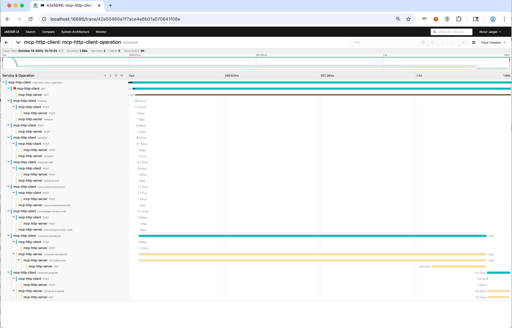

# MCP HTTP Client-Server Example with OpenTelemetry

This example demonstrates a complete Model Context Protocol (MCP) client-server implementation using HTTP transport with automatic OpenTelemetry instrumentation for distributed tracing.

## Overview

The example showcases how MCP requests and responses are automatically traced across client-server boundaries using the OpenTelemetry MCP instrumentation. It includes a simple HTTP server that provides tools, resources, and prompts, and a client that exercises these capabilities while generating comprehensive telemetry data.

## Features

- **MCP Communication**: Client-server communication via HTTP/SSE transport
- **Automatic Tracing**: Zero-code instrumentation for MCP operations
- **Distributed Context**: Trace context propagation between client and server
- **OTLP Export**: Direct integration with OpenTelemetry collectors and Jaeger
- **Complete Coverage**: Traces for tool calls, resource access, and prompt operations

## Prerequisites

- Node.js 18.x or higher
- OpenTelemetry Collector or Jaeger instance for trace collection and visualization

## Setup Instructions

### 1. Build the Server

```bash
cd server
npm install
npm run build
```

### 2. Build the Client

```bash
cd client
npm install
npm run build
```

## Testing with MCP Inspector

Before running the full example, you can test the server using the MCP Inspector:

### Method 1: Stdio Inspector (Recommended)

```bash
cd server
npm run build
npm run inspect
```

This uses a stdio wrapper with the same server logic, providing full inspector functionality to test all tools, resources, and prompts interactively.

### Method 2: HTTP Inspector (Limited Support)

```bash
# Terminal 1: Start HTTP server
cd server
npm start

# Terminal 2: Try HTTP inspector
npm run inspect-http
```

**Note**: HTTP inspector support is limited. Use the stdio inspector for the best testing experience.

## Running the Example

### 1. Start the HTTP Server

In one terminal, start the server with OpenTelemetry instrumentation:

```bash
cd server
OTEL_SERVICE_NAME=mcp-http-server \
  OTEL_TRACES_EXPORTER=otlp \
  OTEL_EXPORTER_OTLP_TRACES_ENDPOINT=http://localhost:4318/v1/traces \
  node --require @opentelemetry/auto-instrumentations-node/register ./build/index.js
```

### 2. Run the HTTP Client

In another terminal, execute the client with OpenTelemetry auto-instrumentation:

```bash
cd client
OTEL_SERVICE_NAME=mcp-http-client \
  OTEL_TRACES_EXPORTER=otlp \
  OTEL_EXPORTER_OTLP_TRACES_ENDPOINT=http://localhost:4318/v1/traces \
  node --require @opentelemetry/auto-instrumentations-node/register ./build/client.js
```

**Environment Variables:**

- `OTEL_SERVICE_NAME`: Identifies the service in traces
- `OTEL_TRACES_EXPORTER`: Specifies OTLP as the trace exporter
- `OTEL_EXPORTER_OTLP_TRACES_ENDPOINT`: Target endpoint for trace data

### Trace Visualization

Once executed, traces will be available in your configured observability backend. The traces will show the complete request flow from client initialization through tool execution, demonstrating timing, context propagation, and MCP-specific attributes over HTTP transport.

## What You'll See

The example generates traces that include:

- MCP session initialization over HTTP
- Tool discovery and execution
- Resource listing and reading
- Prompt retrieval and processing
- HTTP transport layer instrumentation
- Error handling and context propagation

Once executed, traces will be available in your configured observability backend. The following image shows an example trace visualization in Jaeger:



Each trace span includes MCP-specific attributes such as method names, tool names, resource URIs, and request arguments for comprehensive observability across the HTTP transport layer.

## Differences from stdio Example

This HTTP example differs from the stdio version in:

- Uses SSE (Server-Sent Events) transport instead of stdio
- Server runs as a standalone HTTP service on port 3001
- Client connects to `/sse` endpoint for SSE stream, messages sent to `/message`
- Both client and server run independently with separate instrumentation

## Endpoints

- **SSE Connection**: `GET http://localhost:3001/sse` - Establishes the SSE stream
- **Message Posting**: `POST http://localhost:3001/message?sessionId=<id>` - Sends messages to server
