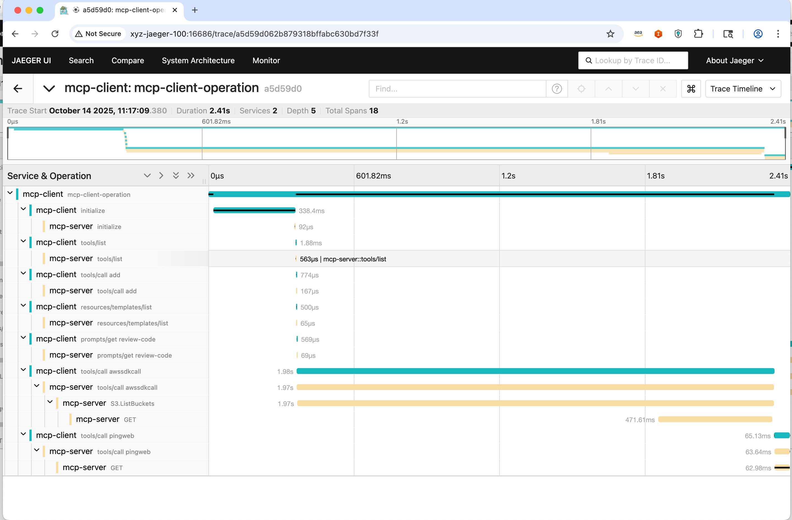

# MCP Client-Server Example with OpenTelemetry

This example demonstrates a complete Model Context Protocol (MCP) client-server implementation with automatic OpenTelemetry instrumentation for distributed tracing.

## Overview

The example showcases how MCP requests and responses are automatically traced across client-server boundaries using the OpenTelemetry MCP instrumentation. It includes a simple server that provides tools, resources, and prompts, and a client that exercises these capabilities while generating comprehensive telemetry data.

## Features

- **MCP Communication**: Client-server communication via stdio transport
- **Automatic Tracing**: Zero-code instrumentation for MCP operations
- **Distributed Context**: Trace context propagation between client and server
- **OTLP Export**: Direct integration with OpenTelemetry collectors and Jaeger
- **Complete Coverage**: Traces for tool calls, resource access, and prompt operations

## Prerequisites

- Node.js 18.x or higher
- OpenTelemetry Collector or Jaeger instance for trace collection and visualization

## Setup Instructions

### 1. Build the Server

```bash
cd server
npm install
npm run build
```

### 2. Build the Client

```bash
cd client
npm install
npm run build
```

## Running the Example

### Standard Execution with OpenTelemetry

Execute the client (OpenTelemetry is automatically configured for the server via stdio transport):

```bash
OTEL_TRACES_EXPORTER=otlp \
  OTEL_EXPORTER_OTLP_TRACES_ENDPOINT=http://localhost:4318/v1/traces \
  node ./build/client.js
```

Note: The client spawns the server with OTel auto-instrumentation enabled. Do not use `--require` on the client when using stdio transport, as it may interfere with the protocol communication.

**Environment Variables:**

- `OTEL_SERVICE_NAME`: Identifies the service in traces
- `OTEL_TRACES_EXPORTER`: Specifies OTLP as the trace exporter
- `OTEL_EXPORTER_OTLP_TRACES_ENDPOINT`: Target endpoint for trace data

### Trace Visualization

Once executed, traces will be available in your configured observability backend. The following image shows an example trace visualization in Jaeger:



The trace demonstrates the complete request flow from client initialization through tool execution, showing timing, context propagation, and MCP-specific attributes.

## What You'll See

The example generates traces that include:

- MCP session initialization
- Tool discovery and execution
- Resource listing and reading
- Prompt retrieval and processing
- Error handling and context propagation

Each trace span includes MCP-specific attributes such as method names, tool names, resource URIs, and request arguments for comprehensive observability.
