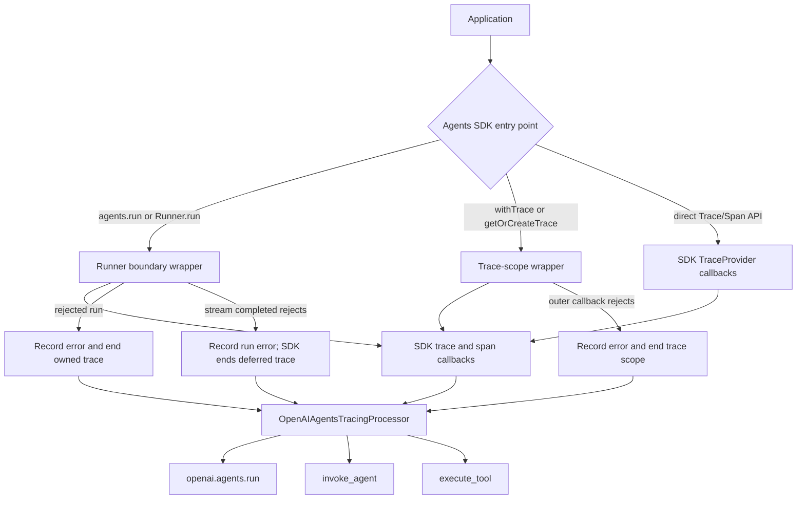

# OpenTelemetry OpenAI Agents Instrumentation for Node.js

[![NPM Published Version][npm-img]][npm-url]
[![Apache License][license-image]][license-image]

This module provides automatic OpenTelemetry instrumentation for the
[`@openai/agents`](https://www.npmjs.com/package/@openai/agents) JavaScript SDK.
It uses the SDK's tracing processor callbacks to emit GenAI agent and
function-tool spans.

Compatible with OpenTelemetry JS API and SDK `1.0+`.

## Installation

```bash
npm install --save @opentelemetry/instrumentation-openai-agents
```

## Supported Versions

- [`@openai/agents`](https://www.npmjs.com/package/@openai/agents) versions `>=0.14.0 <1`

## Usage

Register the instrumentation before loading `@openai/agents`:

```js
const { NodeSDK } = require('@opentelemetry/sdk-node');
const {
  OpenAIAgentsInstrumentation,
} = require('@opentelemetry/instrumentation-openai-agents');

const sdk = new NodeSDK({
  instrumentations: [new OpenAIAgentsInstrumentation()],
});
sdk.start();

process.once('beforeExit', async () => {
  await sdk.shutdown();
});
```

The instrumentation is also enabled by default when using
[`@opentelemetry/auto-instrumentations-node`](https://www.npmjs.com/package/@opentelemetry/auto-instrumentations-node).

### Instrumented SDK entry points

All of the following use the same SDK trace processor and produce the same
span hierarchy:

```ts
// Top-level helper (internally uses Runner.run).
await agents.run(agent, 'Summarize this request');

// Explicit runner invocation.
const runner = new agents.Runner();
await runner.run(agent, 'Summarize this request');

// Streaming invocation. The run span remains open until `completed` settles.
const streamed = await runner.run(agent, 'Stream a response', { stream: true });
for await (const event of streamed) {
  consume(event);
}
await streamed.completed;

// Caller-managed trace scopes, including rejected callbacks.
await agents.withTrace('customer-workflow', async () => {
  await runner.run(agent, 'Run inside this trace');
});

await agents.getOrCreateTrace(async () => {
  await runner.run(agent, 'Reuse an active trace or create one');
});
```

The SDK's `TraceProvider` callbacks are also observed for traces and spans
created directly with the Agents tracing API. This includes agent, task, turn,
and function-tool callbacks, nested agents and tools, handoffs, retries, and
callback-reported errors. Task and turn callbacks are used to build hierarchy
and propagate terminal errors; they do not create duplicate OpenTelemetry
spans.

### How the instrumentation works



The wrappers are lifecycle safety hooks, not a second tracing implementation.
They preserve the SDK's native callbacks and only fill gaps where a rejected
run or stream would otherwise leave an OpenTelemetry span open.

### What is not instrumented

This package intentionally does not instrument:

- OpenAI API/HTTP model calls or token-usage spans. Use
  [`@opentelemetry/instrumentation-openai`](https://www.npmjs.com/package/@opentelemetry/instrumentation-openai)
  for those calls.
- The SDK's native OpenAI trace exporter, unless
  `disableOpenAITraceExport` is enabled.
- `invoke_workflow` spans. The neutral `openai.agents.run` span is a container;
  standalone agent runs are not reported as workflows.
- Separate OpenTelemetry spans for task, turn, generation, response, handoff,
  guardrail, custom, transcription, speech, or MCP callback types. Unsupported
  SDK callback types are retained only as hierarchy/error context where
  applicable.
- Realtime/voice tracing APIs exposed outside the core `Runner` and trace
  lifecycle covered above.
- Guaranteed parentage between model-call spans from separate client
  instrumentations and agent spans. SDK callbacks do not keep an async
  OpenTelemetry context active between span start and end.

### Options

| Option                     | Type      | Default | Description                                                                                                                                                                                                                                                                                 |
| -------------------------- | --------- | ------- | ------------------------------------------------------------------------------------------------------------------------------------------------------------------------------------------------------------------------------------------------------------------------------------------- |
| `captureMessageContent`    | `boolean` | `false` | Capture function tool arguments and results. This may expose sensitive data. The `OTEL_INSTRUMENTATION_GENAI_CAPTURE_MESSAGE_CONTENT` environment variable can also set this option.                                                                                                        |
| `disableOpenAITraceExport` | `boolean` | `false` | Replace the Agents SDK trace processors with the OpenTelemetry processor, disabling its native OpenAI trace export. By default both processors run. Set this before the Agents SDK is loaded; changing it after processor registration is ignored to avoid removing application processors. |

The OpenAI client instrumentation remains responsible for model-call spans.
This package emits the agent orchestration spans and preserves the SDK's task
and turn spans as hierarchy-only callbacks, avoiding duplicate LLM spans. Each
run uses a neutral `openai.agents.run` container span for correlation; it is not
classified as a GenAI workflow.

The JavaScript tracing callbacks are lifecycle notifications; they do not keep
an OpenTelemetry context active between start and end. This instrumentation
therefore constructs the run, agent, and tool hierarchy explicitly, but
model-call spans from separate client instrumentation are not guaranteed to be
children of the agent span. Guaranteeing that relationship would require an
additional runner-boundary context hook.

## Spans

| Agents SDK callback | OpenTelemetry span    | `gen_ai.operation.name` |
| ------------------- | --------------------- | ----------------------- |
| Trace               | `openai.agents.run`   | _not set_               |
| Agent span          | `invoke_agent <name>` | `invoke_agent`          |
| Function span       | `execute_tool <name>` | `execute_tool`          |

## Useful links

- For more information on OpenTelemetry, visit: <https://opentelemetry.io/>
- For more about OpenTelemetry JavaScript: <https://github.com/open-telemetry/opentelemetry-js>
- For help or feedback on this project, join us in [GitHub Discussions][discussions-url]

## License

Apache 2.0 - See [LICENSE][license-url] for more information.

[discussions-url]: https://github.com/open-telemetry/opentelemetry-js/discussions
[license-url]: https://github.com/open-telemetry/opentelemetry-js-contrib/blob/main/LICENSE
[license-image]: https://img.shields.io/badge/license-Apache_2.0-green.svg?style=flat
[npm-url]: https://www.npmjs.com/package/@opentelemetry/instrumentation-openai-agents
[npm-img]: https://badge.fury.io/js/%40opentelemetry%2Finstrumentation-openai-agents.svg
