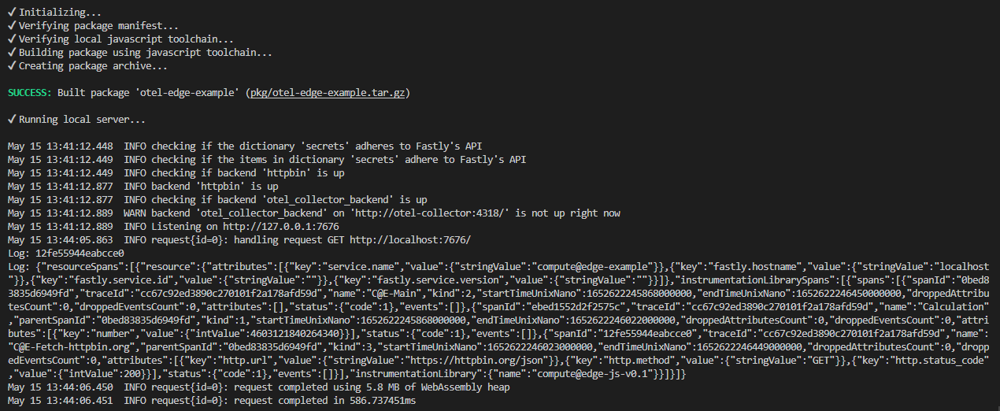
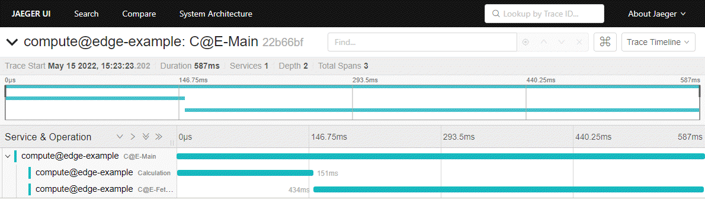

# Examples

> OpenTelemetry Library for Fastly Compute@Edge (JavaScript)

The Fastly CLI allows you to run Compute@Edge functions locally for testing. The examples presented here are utilizing the Fastly CLI to run and you can choose to install the CLI or run the Docker version. In the stand alone example the traces are not forwarded to any OpenTelemetry Collector or sink. The Docker example includes a docker-compose that configures an Open Telemetry Collector and Jaeger as sink for the traces.

## Stand alone example (Fastly CLI)

To run the stand alone example you need to install the Fastly CLI for your environment. The installation instructions can be found on the [Fastly Developer Web](https://developer.fastly.com/reference/cli/).

Once the CLI is installed, make sure you are in the `examples` directory and run `fastly compute serve`. That will bring up the local runtime environment for Fastly Compute@Edge and serve your function. You can access it with, e.g. `curl http://localhost:7676`.

The [example function](./src/index.js) is using the method `outputTracetoStdOut` to output the trace details to stdout after an execution has been completed.



## Docker example

The Docker example is using the same Compute@Edge function as the stand alone example. A Docker Compose configuration sets up the Compute@Edge function in a container, along with an OpenTelemetry Collector and Jaeger containers to demonstrate the full flow of the traces. Simply run docker compose in the examples directory.

```shell
docker-compose up
```

Once the environment is up and running you can access the service on `http://localhost:80` and Jaeger on `http://localhost::16686`. Shortly after a request has been sent to the service the corresponding trace should show up in Jaeger.


