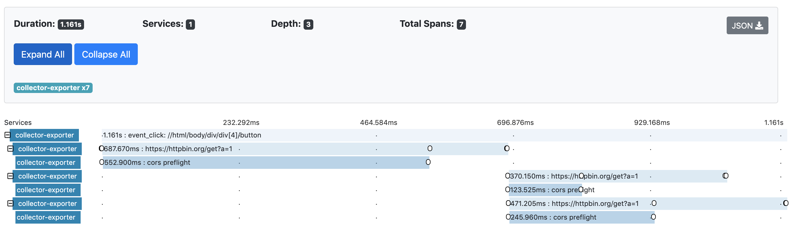
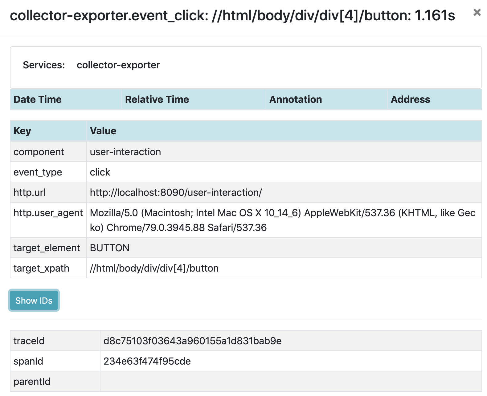
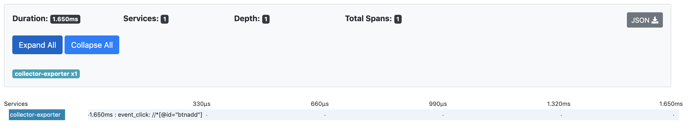
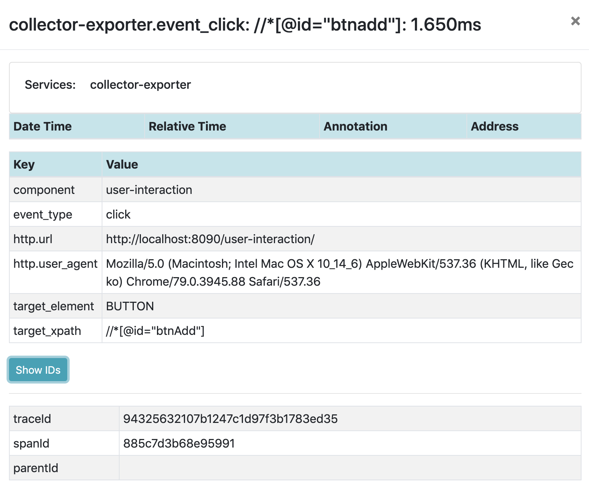

# OpenTelemetry UserInteraction Instrumentation for web

[![NPM Published Version][npm-img]][npm-url]
[![Apache License][license-image]][license-image]

This module provides automatic instrumentation for *user interactions* for Web applications, which may be loaded using the [`@opentelemetry/sdk-trace-web`](https://www.npmjs.com/package/@opentelemetry/sdk-trace-web) package.

If total installation size is not constrained, it is recommended to use the [`@opentelemetry/auto-instrumentations-web](https://www.npmjs.com/package/@opentelemetry/auto-instrumentations-web) bundle with [`@opentelemetry/sdk-trace-web`](https://www.npmjs.com/package/@opentelemetry/sdk-trace-web) for the most seamless instrumentation experience.

Compatible with OpenTelemetry JS API and SDK `1.0+`.

This module can work either with [zone-js] or without it, with [zone-js] and ZoneContextManager it will fully support the async operations. Without [zone-js] it will still work but with limited support.
If you use Angular or [@opentelemetry/context-zone] you will have [zone-js] included.

## Installation

```bash
npm install --save @opentelemetry/instrumentation-user-interaction
```

## Usage

```js
import { ConsoleSpanExporter, SimpleSpanProcessor } from '@opentelemetry/sdk-trace-base';
import { WebTracerProvider } from '@opentelemetry/sdk-trace-web';
import { UserInteractionInstrumentation } from '@opentelemetry/instrumentation-user-interaction';
import { ZoneContextManager } from '@opentelemetry/context-zone';
import { registerInstrumentations } from '@opentelemetry/instrumentation';
// or if you already have zone.js
// import { ZoneContextManager } from '@opentelemetry/context-zone-peer-dep';

const provider = new WebTracerProvider({
  contextManager: new ZoneContextManager()
});

provider.addSpanProcessor(new SimpleSpanProcessor(new ConsoleSpanExporter()));
provider.register();

registerInstrumentations({
  instrumentations: [
    new UserInteractionInstrumentation(),
  ],
});

// and some test
const btn1 = document.createElement('button');
btn1.append(document.createTextNode('btn1'));
btn1.addEventListener('click', () => {
  console.log('clicked');
});
document.querySelector('body').append(btn1);

const btn2 = document.createElement('button');
btn2.append(document.createTextNode('btn2'));
btn2.addEventListener('click', () => {
  getData('https://httpbin.org/get').then(() => {
    getData('https://httpbin.org/get').then(() => {
      console.log('data downloaded 2');
    });
    getData('https://httpbin.org/get').then(() => {
      console.log('data downloaded 3');
    });
    console.log('data downloaded 1');
  });
});
document.querySelector('body').append(btn2);

function getData(url) {
  return new Promise(async (resolve) => {
    const req = new XMLHttpRequest();
    req.open('GET', url, true);
    req.setRequestHeader('Content-Type', 'application/json');
    req.setRequestHeader('Accept', 'application/json');
    req.send();
    req.onload = function () {
      resolve();
    };
  });
}

// now click on buttons

```

## Example Screenshots






## Useful links

- For more information on OpenTelemetry, visit: <https://opentelemetry.io/>
- For more about OpenTelemetry JavaScript: <https://github.com/open-telemetry/opentelemetry-js>
- For help or feedback on this project, join us in [GitHub Discussions][discussions-url]

## License

Apache 2.0 - See [LICENSE][license-url] for more information.

[discussions-url]: https://github.com/open-telemetry/opentelemetry-js/discussions
[license-url]: https://github.com/open-telemetry/opentelemetry-js/blob/main/LICENSE
[license-image]: https://img.shields.io/badge/license-Apache_2.0-green.svg?style=flat
[npm-url]: https://www.npmjs.com/package/@opentelemetry/instrumentation-user-interaction
[npm-img]: https://badge.fury.io/js/%40opentelemetry%2Finstrumentation-user-interaction.svg
[zone-js]: https://www.npmjs.com/package/zone.js
[@opentelemetry/context-zone]: https://www.npmjs.com/package/@opentelemetry/context-zone
